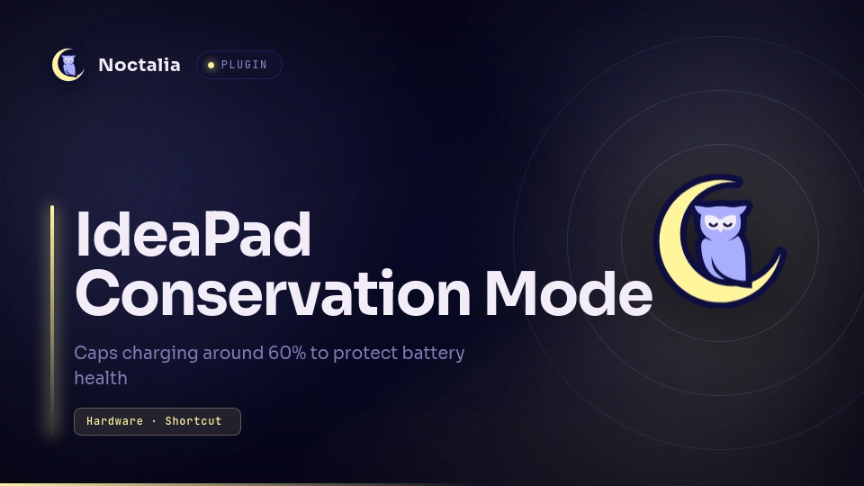

# IdeaPad Conservation Mode


**IdeaPad Conservation Mode** is a Control Center shortcut plugin for [Noctalia](https://docs.noctalia.dev) (v5) that toggles **Conservation Mode** — capping charging around ~60% to preserve battery health — via the `ideapad_acpi` kernel driver's `conservation_mode` sysfs attribute. That driver covers Lenovo IdeaPad and Legion laptops alike, not just Legion.

Writing that attribute needs root by default. The first time you click the tile and the write fails, the plugin opens a terminal and runs a bundled one-time setup script with `sudo`. It creates a `lenovoctl` group, adds you to it, and installs a udev rule so future writes are unprivileged. Log out and back in once afterward; every click after that just works, with no further prompts.

## Plugin

| Field | Value |
| --- | --- |
| ID | `lux/ideapad-conservation-mode` |
| Entries | Shortcut: `conservation-mode` |

## Requirements

The bundled setup script (`scripts/setup-permissions.sh`) shells out to `sudo`, `dirname`, `env`, `bash`, `chgrp`, `chmod`, `getent`, `groupadd`, `usermod`, `cat`, and `udevadm`. All of these ship by default on essentially every mainstream Linux distribution (coreutils, util-linux, shadow-utils, systemd/udev).

## Usage

Add the `conservation-mode` shortcut under Settings → Control Center shortcuts. Click it to toggle Conservation Mode; the label shows the current state (On / Off / N/A if the sysfs attribute can't be found). The first click may open a terminal for the one-time `sudo` setup described above.

## NixOS

`/etc/udev/rules.d` is generated from system config on NixOS, so the setup script exits instead of writing to it. Add the equivalent declaratively instead:

```nix
{
  users.groups.lenovoctl = {};
  users.users.<your-username>.extraGroups = [ "lenovoctl" ];

  services.udev.extraRules = ''
    ACTION=="add|change", SUBSYSTEM=="platform", DRIVER=="ideapad_acpi", RUN+="${pkgs.coreutils}/bin/chgrp lenovoctl /sys%p/conservation_mode", RUN+="${pkgs.coreutils}/bin/chmod 664 /sys%p/conservation_mode"
  '';
}
```

Rebuild, log out and back in, then click the tile.
